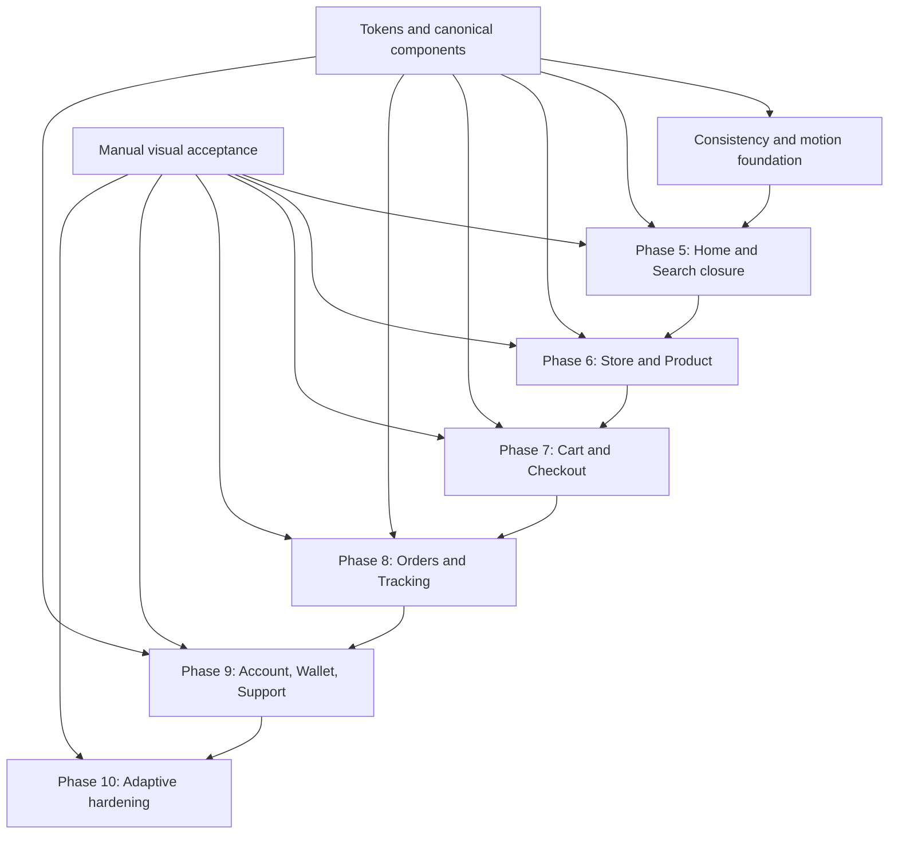

# SIP Customer Premium Revamp — Implementation Plan

## Outcome

Deliver one coherent, premium, deliveries-only customer application across marketplace, single-vendor, and chain modes. The implementation must preserve the existing APIs, state, navigation, payments, checkout, tracking, localization, and delivery behavior while replacing the visual presentation and interaction layer.

The target is not a collection of individually polished screens. It is one reusable UI system expressed consistently from Home through delivery tracking and support.

## Sources of truth

Implementation decisions must be resolved in this order:

1. `PRODUCT.md` — product truth and adaptive platform requirement.
2. `DESIGN.md` — premium urban delivery concierge visual direction.
3. `docs/ui-revamp/visual-reference-plan.md` — approved screen compositions and consistency contract.
4. `docs/ui-revamp/design-system.md` — token and primitive engineering contract.
5. Existing business logic, API models, stores, hooks, and navigation contracts.

Generated visual boards are compositional references. They do not override real data, localization, accessibility, native safe areas, or platform behavior.

## Current technical baseline

- Expo SDK 54 and React Native 0.81.
- React Native New Architecture enabled.
- React Navigation 6 with separate marketplace, single-vendor, and chain navigators.
- FlashList 2 available for long, recycled collections.
- `expo-glass-effect` and `expo-blur` available for guarded iOS material and fallback behavior.
- Semantic theme, spacing, type, radius, elevation, layout, and motion tokens already exist.
- Shared reduced-motion handling exists.
- `react-native-reanimated` is declared at the Expo SDK 54-compatible `~4.1.1` version; `expo-haptics` remains intentionally deferred until a meaningful success/selection use case exists.

## Live implementation progress

- Work package A1: adaptive platform metadata and Reanimated dependency alignment are complete.
- Phase 5.1: the shared `DeliveryHomeScaffold` is implemented across marketplace, single-vendor, and chain Home screens. It owns the continuous header-to-search gradient, UI-thread scroll progress, search-surface motion, opaque header reveal, safe-area/content insets, and reduced-motion behavior.
- Phase 5.2: the shared discovery hierarchy pass is in progress. Canonical section headers, category tiles, offer badges, merchant metadata order, rail shadow clearance, and matching loading geometry are implemented for the first Home batch.
- Phase 5.3: Search and See-All closure is in progress. Search is now command-first, shares the vertical atmosphere, uses focus-responsive search material, compact merchant-result rows, FlashList-backed product rails, and the existing bounded result-settle motion.
- Phase 5 Home/Search received the user’s move-forward acceptance after its screenshot-led corrections.
- Phase 6.1 is implemented for Store Details: it now has bounded UI-thread merchant-media parallax, a shallow scroll-responsive hero transition, persistent adaptive navigation controls, a compact identity header on collapse, real-data merchant hierarchy, secondary business information in the info popup, and loading geometry matched to the destination composition.
- Phase 6.2 is in progress through the reference-led Store Details composition: search and primary categories form one sticky menu-navigation layer, primary categories use image-aware canonical capsules, subcategories use the quieter secondary grammar, menu products use information-dense horizontal commerce rows, and the floating cart has become a full-width real-data commerce bar with guarded platform material.
- The Store Details visual authority is the supplied premium reference plus its implementation brief. Fidelity means reproducing its connected hero/identity/menu rhythm with SIP tokens and live data—not merely retaining the same section order. The authored motion moment is a coordinated cover scale/parallax, real-tagline media treatment, morphing asymmetric hero contour, merchant-card handoff, collapsed-title crossfade, and sticky menu navigation.

## Architecture decisions before screen work

### 1. Shared owners, not screen-local styling

Every repeated visual behavior has one owner. Screens compose these components and provide content; they do not replace internal color, shape, target size, shadow, or motion.

Planned canonical families:

- `AppText`
- `Button` and `IconButton`
- `PressableScale`
- `SelectionControl` and `SelectionIndicator`
- `Card` and `Surface`
- `ScreenHeader`, `DeliveryHeader`, and `CollapsingMediaHeader`
- `PlatformGlassSurface`
- `DeliveriesTabBar`
- `CommerceActionBar`
- `ListRow`, `ReceiptRow`, and `SettingRow`
- `StatusBadge`, `StatusBanner`, and `StatusTimeline`
- `AppSheet` and shared sheet handle/scrim behavior
- `AppImage` or equivalent media-state wrapper
- `EmptyState`, `ErrorState`, and skeleton geometry

Existing components should be extended or consolidated before adding a new abstraction. A new component is justified only when at least two screens share the behavior or when it owns a non-negotiable platform/accessibility rule.

### 2. Selection grammar

Tabs, category strips, filter chips, segmented choices, radio options, fulfillment choices, tip choices, and product options share:

- The same semantic selected, unselected, pressed, disabled, and focused colors.
- The same label-weight transition.
- The same 100–160ms acknowledgement.
- The same accessibility selection state.
- Related shape language without forcing every control into the same dimensions.

`TabSwitcher` becomes the first consumer of the shared selection primitive. Checkout, store tabs, filters, and product options migrate to that primitive instead of restyling it.

### 3. Motion engine boundary

- Keep simple one-shot press, opacity, icon, and selection feedback in existing primitives when the native driver is sufficient.
- Add the Expo-compatible Reanimated version before implementing scroll-, gesture-, sheet-, map-, or layout-linked motion.
- Reanimated owns the Home scroll atmosphere, merchant collapsing header, tracking sheet/map coordination, and any gesture-interactive transition.
- Do not mix two animation engines inside one coordinated interaction.
- All motion resolves from semantic duration and distance tokens and the shared reduced-motion preference.

### 4. Platform material boundary

- Supported iOS: guarded native Liquid Glass for functional floating navigation and transient media/map controls.
- Earlier iOS or Reduce Transparency: legible blur or solid material fallback.
- Android: tonal surfaces, state layers, ripple, and elevation; no imitation glass.
- Content cards remain opaque or tonal on every platform.

## Execution sequence

## Work package A — consistency and motion foundation

This package is completed before additional screen-by-screen styling.

### A1. Platform and dependency alignment

- Record the platform as `adaptive` in `PRODUCT.md`.
- Add the Expo-compatible Reanimated package before scroll-driven work.
- Confirm New Architecture and current Expo compatibility before using performance flags.
- Do not add haptics until the first meaningful success/selection use case is implemented; avoid a dependency added only for decorative tapping.

### A2. Canonical selection primitive

Primary targets:

- `src/general/components/TabSwitcher.tsx`
- `src/general/components/search/SearchChip.tsx`
- `src/apps/deliveries/multiVendor/components/StoreDetails/StoreDetailTabs.tsx`
- `src/apps/deliveries/components/checkout/CheckoutModeTabs.tsx`
- `src/apps/deliveries/components/productInfo/ProductOptionRow.tsx`

Deliverables:

- One selected-state resolver and indicator motion.
- Compact, equal-width, and scrollable layouts.
- Selected/disabled/pressed accessibility state.
- Light, dark, iOS, and Android semantic styling.

### A3. Canonical commerce action bar

Primary targets:

- `src/apps/deliveries/components/productInfo/Footer.tsx`
- `src/apps/deliveries/components/cart/CartFooter.tsx`
- `src/apps/deliveries/components/checkout/CheckoutSummaryFooter.tsx`
- `src/apps/deliveries/multiVendor/components/StoreDetails/StoreDetailActionButton.tsx`

Deliverables:

- Stable safe-area placement and content inset ownership.
- Shared quantity, total, loading, disabled, and network-pending behavior.
- No layout jump when price, quantity, or translated labels change.

### A4. Header system consolidation

Primary targets:

- `src/general/components/ScreenHeader.tsx`
- `src/general/components/Header.tsx`
- `src/apps/deliveries/components/MultiVendorAddressHeader.tsx`
- `src/apps/deliveries/components/checkout/CheckoutHeader.tsx`
- `src/apps/deliveries/components/cart/CartHeader.tsx`
- `src/apps/deliveries/components/productInfo/ImageHeader.tsx`

Deliverables:

- Three documented variants: delivery, standard, collapsing media.
- One icon-button geometry and safe-area contract.
- No screen-local top padding or duplicated header shadow.

### A5. Depth and clipping audit

- Separate media clipping from elevated card wrappers.
- Remove raw screen-local shadows where semantic elevation exists.
- Verify horizontal rails reserve enough vertical and side clearance for shadows.
- Use tonal separation before introducing another container.

## Phase 5 — Home and Search closure

### 5.1 Continuous Home atmosphere

Primary targets:

- `src/apps/deliveries/components/home/DeliveryHomeIntro.tsx`
- `src/apps/deliveries/components/MultiVendorAddressHeader.tsx`
- `src/apps/deliveries/multiVendor/screens/HomeTab/HomeTab.tsx`
- `src/apps/deliveries/multiVendor/screens/HomeTab/HomeTabStyle.ts`
- `src/apps/deliveries/singleVendor/screens/HomeScreen/HomeScreen.tsx`
- `src/apps/deliveries/chain/screens/HomeScreen.tsx`

Implementation:

- Create one `DeliveryHomeAtmosphere` composition shared by all three operating modes.
- Render one continuous gradient behind the safe-area delivery header and focused search entry, ending before the first discovery heading.
- Drive header compression, search lift/scale, lens/arrow parallax, and a single bounded material sheen from one normalized UI-thread scroll progress value.
- Keep content interactive throughout the transition.
- Reverse naturally with scrolling rather than replaying entrance animation.
- Preserve stable content height to avoid rail jumps.
- In reduced-motion mode, use immediate layout state plus a brief opacity transition only.

Acceptance:

- No visible seam between header and search gradient.
- No JavaScript-thread scroll listener updating React state per frame.
- No clipped card shadows or content hidden behind the delivery dock.
- Marketplace, single-vendor, and chain Home screens visibly belong to the same product.

### 5.2 Discovery hierarchy

Primary targets:

- `src/apps/deliveries/multiVendor/components/HomeTab/*`
- `src/apps/deliveries/singleVendor/components/HomeScreen/*`
- `src/apps/deliveries/chain/components/homeScreen/*`
- `src/apps/deliveries/components/storeCard/*`
- `src/apps/deliveries/components/productCard/*`

Implementation:

- Match the approved board’s hierarchy, not its sample merchant data.
- Standardize rail header alignment, card media ratios, metadata, offer treatment, and scroll peek.
- Limit initial entrance choreography to the existing three grouped beats.
- Ensure the dock underlay remains visually useful enough for Liquid Glass to read as glass.

### 5.3 Search and see-all

Primary targets:

- `src/general/components/search/*`
- `src/apps/deliveries/components/search/*`
- `src/apps/deliveries/screens/SeeAllScreen/*`
- Mode-specific Search screens.

Implementation:

- Preserve query, filters, origin, and scroll position when navigating to a result and back.
- Distinguish store and product results through composition, not unrelated card themes.
- Use FlashList for long heterogeneous results with stable keys and item types.
- Keep result-set changes to one 240ms-or-shorter settle transition.

Phase 5 exit gate:

- Home and Search match the approved reference direction.
- Continuous scroll atmosphere is complete on all delivery modes.
- Loading, empty, offline, error, compact, medium, expanded, dark, and reduced-motion states use the same geometry and tokens.
- User manually accepts the visible Home/Search result before Phase 6 expands the system.

## Phase 6 — Store and Product

### 6.1 Store journey header

Primary targets:

- `src/apps/deliveries/multiVendor/screens/StoreDetailsScreen/StoreDetailsScreen.tsx`
- `src/apps/deliveries/multiVendor/components/StoreDetails/*`

Implementation:

- Immersive merchant media with bounded parallax.
- Collapses into a compact merchant-identity header containing only persistent, useful information.
- Favorite, back, and share controls use the media-overlay material contract.
- Rating, fee, ETA, distance, availability, and fulfillment stay readable without nested cards.
- Permanent phone, email, and address copy moves into the information popup; no sample storefront content is introduced.

### 6.2 Store menu and categories

- Migrate category tabs to the canonical selection primitive.
- Make category-to-section navigation deterministic and preserve visible section state.
- Use FlashList types for header, subcategory, and product cells.
- Product rows share one image, price, availability, customization, and add-action grammar.
- Product media resolves in this order: live product image, live category/subcategory image, then a branded non-photographic fallback. Blank grey media wells and fabricated food photography are both prohibited.
- Search and primary category navigation remain sticky below the collapsed store header while section content continues to scroll.
- Category imagery is used only when supplied by the store API; offers retain the shared semantic icon.
- The persistent cart action displays the live cart count and total and navigates through the existing Cart route.

### 6.3 Product detail and configuration

Primary targets:

- `src/apps/deliveries/components/productInfo/*`

Implementation:

- Separate required choices from optional additions.
- Replace the current non-native-driver scroll animation path with the shared coordinated motion approach.
- Keep selection, price, quantity, availability, and validation causal and immediate.
- Use the canonical commerce action bar.
- Cover min/max selection, unavailable option, sold out, price change, store conflict, loading, and retry states.

Phase 6 exit gate:

- Store-to-product navigation feels continuous.
- All selection controls use one grammar.
- Collapsing media remains smooth during image loading and on mid-range Android devices.
- Product configuration cannot produce an ambiguous or invalid cart state.

## Phase 7 — Cart and Checkout

### 7.1 Cart

Primary targets:

- `src/apps/deliveries/screens/CartScreen/CartScreen.tsx`
- `src/apps/deliveries/components/cart/*`

Implementation:

- Establish merchant context, editable item rows, recommendations, promo, fee explanation, total, and checkout action in one hierarchy.
- Preserve row position during quantity and removal updates.
- Keep optimistic feedback reversible and expose server correction clearly.
- Make empty cart, stale item, unavailable item, minimum-order, store conflict, and fee-error states intentional.

### 7.2 Checkout

Primary targets:

- `src/apps/deliveries/screens/CheckoutScreen/CheckoutScreen.tsx`
- `src/apps/deliveries/components/checkout/*`

Implementation:

- Use canonical selection for delivery mode, schedule, payment, and tip.
- Reveal detail screens/sheets only when needed; keep the main summary scannable.
- Keep final price and primary action stable while preview data refreshes.
- Cover address, schedule, payment, coupon, tip, note, Stripe, network, and order-placement recovery states.

### 7.3 Confirmation chain

- Transition from final checkout state to a concise order confirmation without losing order context.
- Success motion runs once and remains under 340ms; reduced motion resolves immediately.
- Tracking is the primary continuation; receipt and support remain available.

Phase 7 exit gate:

- All totals reconcile visually and numerically.
- Every recoverable failure keeps entered checkout context.
- Product → cart → checkout → confirmation feels causally connected.

## Phase 8 — Orders and Tracking

### 8.1 Orders and details

Primary targets:

- `src/apps/deliveries/screens/OrdersScreen/OrdersScreen.tsx`
- `src/apps/deliveries/screens/OrderDetailsScreen/OrderDetailsScreen.tsx`
- `src/apps/deliveries/components/orders/*`
- `src/apps/deliveries/components/orderDetails/*`

Implementation:

- Prioritize active orders, then history.
- Standardize status, merchant identity, ETA, price, reorder, receipt, rating, and help.
- Live status changes crossfade without reordering content unexpectedly.

### 8.2 Live tracking

Primary targets:

- `src/apps/deliveries/screens/OrderTrackingScreen/OrderTrackingScreen.tsx`
- `src/apps/deliveries/components/orderTracking/*`
- `src/apps/deliveries/screens/RiderChatScreen/RiderChatScreen.tsx`

Implementation:

- Treat map, ETA, timeline, courier contact, and order/help as one composition.
- Use a two-detent opaque information sheet over the map.
- Reserve Liquid Glass for compact controls floating over the map.
- Reconcile current legacy/modern variants into one visual contract before removing either path.
- Animate route/status changes causally; avoid looping map or status decoration.

Phase 8 exit gate:

- Preparing, assigned, picked up, nearby, delivered, delayed, cancelled, no-courier, reconnecting, and location-unavailable states are explicit.
- Tracking remains readable when the map fails or location permission is unavailable.

## Phase 9 — Account, Wallet, and Support

### 9.1 Profile, favorites, and addresses

- Prioritize Orders, Addresses, Favorites, and Payment above preferences.
- Reuse row, section, header, and status owners.
- Keep address search, map choice, and address detail as one recoverable flow.

### 9.2 Wallet and coupons

Primary targets:

- `src/apps/deliveries/screens/wallet/*`
- `src/apps/deliveries/components/wallet/*`
- `src/apps/deliveries/screens/CouponsScreen/CouponsScreen.tsx`

Implementation:

- Make balance, payment method, rewards, coupons, and ledger visually trustworthy.
- Align transaction numbers and statuses consistently.
- Treat payment entry as sensitive, calm, and native rather than decorative.

### 9.3 Support

Primary targets:

- `src/apps/deliveries/screens/Support*`
- `src/apps/deliveries/components/support/*`
- Shared chat components.

Implementation:

- Make support order-aware and resolution-first.
- Present tracking, chat, report, FAQ, conversation, and ticket paths in priority order.
- Standardize message, attachment, sending, retry, closed, deleted, empty, and offline states.

### 9.4 Authentication and settings

- Migrate remaining shared shell screens only after the transaction spine proves the system.
- Apply the same type, field, button, row, error, and loading primitives without adding another identity.

Phase 9 exit gate:

- Root Profile, wallet, support, address, and settings surfaces clearly belong to the same application as Home and Checkout.
- Sensitive and destructive actions have unambiguous confirmation and recovery behavior.

## Phase 10 — adaptive hardening

Apply to every completed phase:

- Light and independently designed dark mode.
- English and French with long-label and dynamic-type tolerance.
- VoiceOver/TalkBack labels, roles, selected/expanded/disabled states, focus order, and minimum targets.
- Reduce Motion, Reduce Transparency, and increased-contrast behavior.
- Compact phone, large phone, tablet/expanded, portrait, landscape, and keyboard-open layouts.
- Loading, empty, error, offline, retry, stale, disabled, success, and image failure states.
- Slow network, duplicate taps, interrupted navigation, and resumed-session behavior.
- Release-mode list, scroll, image, memory, and animation profiling when the user requests automated validation.

## Manual visual review matrix

The user manually verifies implemented batches. Codex does not run automated tests, type checks, linters, builds, or bundles unless explicitly requested.

For each visible batch, compare against the reference at:

- iOS supported Liquid Glass device.
- Earlier iOS or Reduce Transparency fallback.
- Mid-range Android tonal-material presentation.
- Compact and large phone widths.
- Light and dark modes.
- English and French.
- Standard and Reduced Motion.
- Populated, loading, empty, error, offline, and image-failure states.

Visual review questions:

1. Is the primary action identifiable in one glance?
2. Is every repeated component recognizably the same family?
3. Does content remain stable when data or translated text changes?
4. Is glass restricted to navigation/control layers?
5. Does motion explain cause and effect without delaying the task?
6. Are shadows, safe areas, keyboard insets, and bottom navigation clearances intact?
7. Does Android feel native rather than like a failed copy of iOS?

## Performance guardrails

- One UI-thread scroll progress value per coordinated scrolling composition.
- Prefer transform and opacity; avoid per-frame React state and layout-affecting animation.
- No more than three grouped entrance beats on a screen.
- No decorative loop after settled content.
- Stable list keys, item types, memoized render inputs, and recycling-safe cell state.
- Bounded media dimensions and placeholder geometry before image decode.
- Blur/glass only where visible and functionally justified.
- No shadow inside a clipping parent.
- Avoid remounting root lists when filters, quantities, or live statuses update.
- Motion remains interruptible and navigation is never blocked by an animation.

## First implementation batch

The first code batch after this plan is **Phase 5A: Home atmosphere and shared scroll motion**.

Order:

1. Add the Expo-compatible Reanimated dependency.
2. Introduce the shared scroll-progress/reduced-motion adapter.
3. Build `DeliveryHomeAtmosphere` from the existing delivery header and intro content.
4. Integrate marketplace Home first without changing business data.
5. Apply the same composition to single-vendor and chain modes.
6. Refine card/dock underlap and shadow clearance.
7. Hand the result to the user for manual review before proceeding to Search closure.

This batch is intentionally narrow in business scope and major in visible impact: it establishes the gradient continuity, scroll identity, platform material relationship, and motion quality that every later collapsing or floating surface will inherit.
