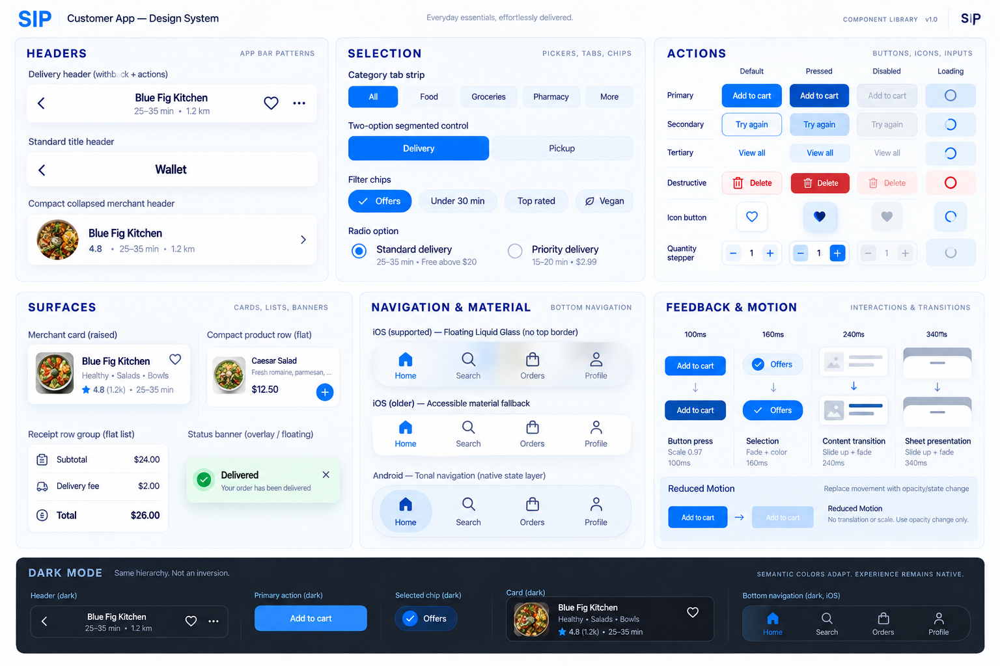
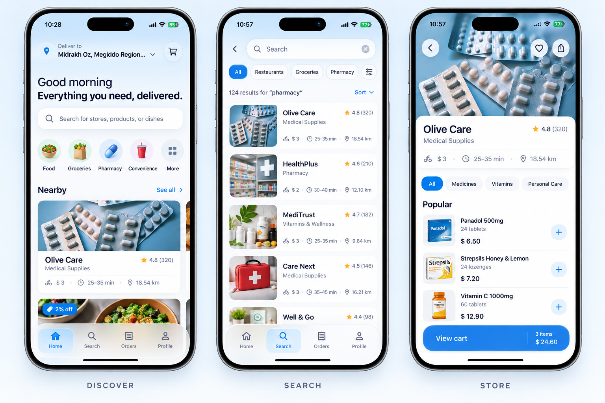
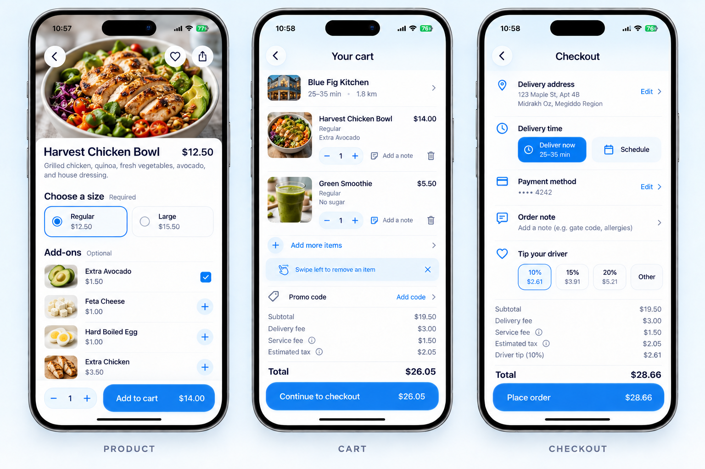
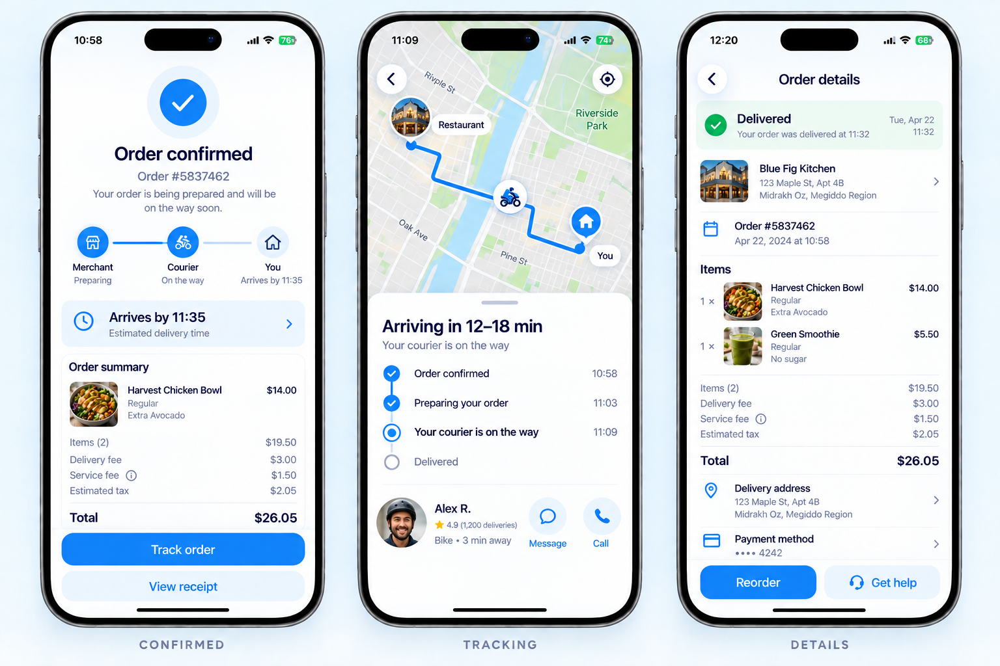
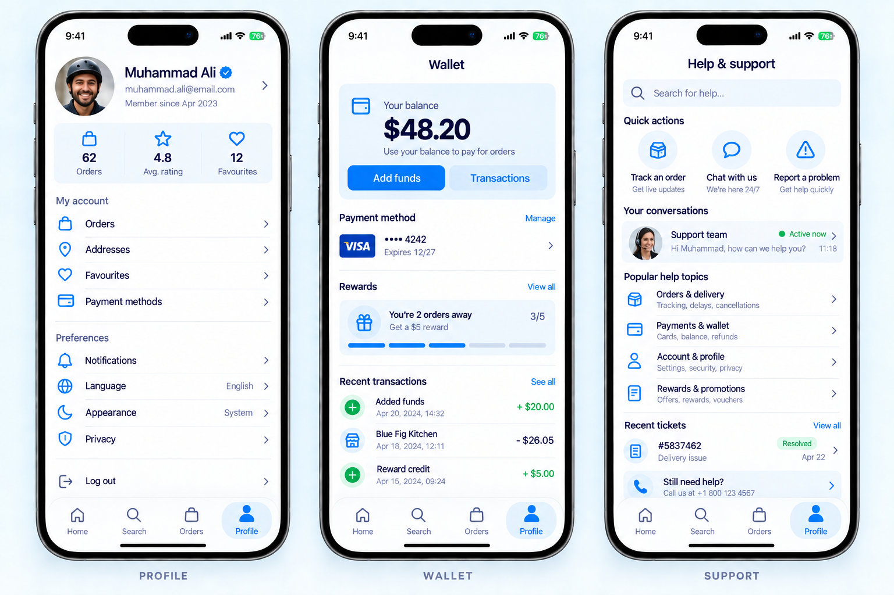
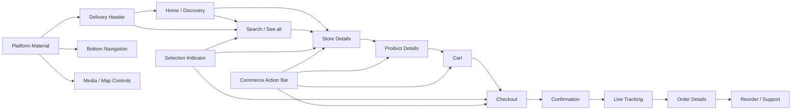

# SIP Premium Revamp — Visual Reference and Consistency Plan

## Purpose and authority

This document is the screen-level north star for the SIP Customer premium revamp. `PRODUCT.md` owns product truth, `DESIGN.md` owns the visual world, and `docs/ui-revamp/design-system.md` owns the engineering primitives. The boards below define composition and hierarchy; they are not permission to reproduce generated text, sample data, or platform chrome literally.

The governing idea is one **premium urban delivery concierge** experience across discovery, purchase, fulfillment, and account management. Creativity comes from composition, imagery, continuity, and interaction—not from giving every screen a different visual theme.

## Important screens, in implementation priority

### Tier 1 — transaction spine

These screens determine whether the revamp succeeds and must be visually approved before lower-priority settings work.

1. Home / Discovery
2. Search and Results
3. Store Details
4. Product Details and Configuration
5. Cart
6. Checkout
7. Order Confirmation
8. Live Order Tracking
9. Order Details and History

### Tier 2 — trust and retention

10. Profile / Account Hub
11. Wallet, payment methods, coupons, and transactions
12. Help and Support, conversations, tickets, FAQ, and rider chat
13. Address search, map selection, and address details
14. Favorites and reorder
15. Notifications

### Tier 3 — entry and configuration

16. Splash, login, signup, OTP, and password recovery
17. Edit profile
18. Settings, language, appearance, and notification preferences
19. Legal and privacy screens
20. Empty, loading, offline, error, disabled, and success variants for every screen above

## Visual reference boards

The boards intentionally use one visual system across the whole journey. Production implementation must use real localized content, real navigation behavior, and the shared primitives.

### Canonical component grammar

### Discovery, Search, and Store

### Product, Cart, and Checkout

### Confirmation, Tracking, and Order Details

### Profile, Wallet, and Support

## Journey and component topology

## One-system consistency contract

### Component identity

The same semantic component must keep the same visual DNA everywhere. A screen can change content and layout, but it cannot locally invent another version.

| System | Canonical behavior | Allowed variation | Never allowed |
| --- | --- | --- | --- |
| Bottom navigation | Four stable destinations, shared icon family, compact selected tint island, preserved tab state | Native Liquid Glass on supported iOS; accessible blur/solid fallback; Android tonal material | Screen-specific tab shape, hidden destinations, top border, oversized selected tile |
| Tabs and segmented choices | One `SelectionIndicator` grammar, shared label weights, focus/press/disabled states | Scrollable category tabs, equal-width segmented choices, compact filter chips | Different blue, radius, animation, or selection treatment per screen |
| Headers | Delivery, standard, and media-collapse variants built from one header system | Contextual title, leading/trailing actions, collapse range | Ad-hoc padding, arbitrary safe-area handling, unrelated icon buttons |
| Cards and surfaces | Semantic flat, raised, floating, and overlay levels | Merchant, product, receipt, status, and media compositions | Raw shadows, clipped elevation, glass content cards, nested-card decoration |
| Buttons | Primary, secondary, tertiary, destructive, and icon variants | Sticky or inline placement; loading and disabled states | Screen-local height, radius, gradient fill, or press animation |
| Rows | Shared target height, typography, divider, leading icon/media, trailing metadata | Settings, receipt, option, transaction, and support content | A card around every row or inconsistent chevrons and spacing |
| Sheets | Shared handle, radius, scrim, safe area, detents, dismissal feedback | Content-specific heights and map-tracking snap points | One-off modal chrome or slow cinematic entrance |
| Status | Semantic success, warning, error, pending, live, and neutral roles | Badge, banner, timeline, or inline label | Relying on color alone or inventing status colors locally |
| Media | Shared aspect ratios, crop, skeleton, fallback, error, and accessibility rules | Merchant hero, product image, avatar, map | Layout shift, unbounded image decode, missing failure state |

### Surface hierarchy

- `canvas`: the page background and atmospheric gradient.
- `surface`: ordinary content and grouped rows.
- `surfaceRaised`: merchant/product cards and focused search controls.
- `surfaceFloating`: sticky commerce actions and transient controls.
- `overlay`: sheets, dialogs, and blocking states.
- Liquid Glass is a **functional navigation/control material**, not a content surface.

### Shape hierarchy

- Controls: 10–12 radius.
- Standard surfaces: 16 radius.
- Hero media and major sheets: 20–24 radius.
- Pills only for true chips, status, compact segmented choices, or selection indicators.
- Shape communicates hierarchy; it is not decoration applied to every container.

## Signature gradient and scroll continuity

Home owns a recognisable atmospheric composition rather than a detachable blue banner.

1. The gradient begins behind the safe-area delivery header.
2. It continues without a seam through a focused search entry; the earlier greeting, editorial headline, and supporting copy have been deliberately removed to keep Home immediate.
3. It fades into the content canvas before the first major rail.
4. One normalized scroll progress value drives the entire transition on the UI thread.
5. As the user scrolls, the search surface lifts and tightens, its lens and directional details move in shallow parallax, and the header resolves into compact navigation chrome.
6. Reverse scrolling restores the composition continuously; there is no replayed entrance sequence.
7. Reduced Motion keeps the crossfade and state change but removes parallax and meaningful travel.

The scroll connection must be implemented as one coordinated transformation, not several components independently listening to JavaScript scroll events. The gradient itself should remain inexpensive and stable; animate transforms, opacity, and masks rather than recalculating layout or color stops every frame.

## Screen composition contracts

| Screen | Focal moment | Required composition | Signature interaction |
| --- | --- | --- | --- |
| Home | Immediate sense of place and possibility | Continuous delivery-header-to-search gradient, direct search, curated discovery, strong merchant imagery | Coordinated gradient/header/search compression on scroll |
| Search | Fast narrowing without losing context | Persistent query, compact filters, clear merchant/product distinction, retained scroll/query | Results settle with a short crossfade and 2–4px movement |
| Store | Merchant identity plus fast menu scanning | Collapsing media hero, essential metadata, category tabs, product list, stable cart action | Hero collapses into a useful merchant header |
| Product | Confident configuration | Product media, description, required choices before optional additions, quantity and price anchored | Selected options and total respond immediately |
| Cart | Editability and transparent totals | Merchant context, editable rows, promo, fees, total, checkout action | Quantity/removal updates without losing row position |
| Checkout | Confidence and error prevention | Address, fulfillment time, payment, note, tip, receipt summary, final action | Only relevant detail panels reveal; action stays stable |
| Confirmation | Causal continuity | Concise success, ETA, order path, summary, tracking action | Success and path resolve once, quickly |
| Tracking | Trust under uncertainty | Useful map, ETA, status timeline, courier actions, order/help access | Map and two-detent information sheet behave as one surface |
| Order details | Receipt plus next action | Status, merchant, items, totals, delivery/payment, reorder/help | Live status crossfades without layout jump |
| Profile | High-frequency account tasks first | Identity, useful stats, orders/addresses/favorites/payment before preferences | Same bottom-navigation response as every root tab |
| Wallet | Clear value and transaction trust | Balance, funding, payment method, reward progress, aligned ledger | Values update by crossfade; no theatrical counters |
| Support | Fast route to resolution | Contextual search, order-aware actions, active conversations, FAQ, tickets | Expansions are brief and support state stays visible |

## Motion grammar

Motion is a system-level primitive and must communicate cause and effect. It must never make a repeat customer wait.

| Intent | Duration | Typical properties | Examples |
| --- | --- | --- | --- |
| Instant feedback | 100ms | opacity, state layer | touch down, toggle acknowledgement |
| Quick selection | 160ms | opacity, scale, 2px translation | tab, chip, quantity, favorite |
| Standard continuity | 240ms | opacity and 2–8px transform | result change, card-to-detail continuity, compact header |
| Deliberate transition | up to 340ms | transform with opacity | sheet, confirmation, major state transition |

Rules:

- Prefer UI-thread transforms and opacity; avoid animating width, height, padding, margin, top, or left during scrolling.
- No perpetual decorative motion after a screen settles.
- Entrance choreography is capped at three grouped beats and must remain interactive while running.
- A frequently repeated action gets smaller motion than a rare transition.
- Haptics supplement visible feedback for meaningful selection, success, warning, and destructive confirmation; they do not fire on every scroll or ordinary tap.
- Reduced Motion removes travel, parallax, looping skeleton pulses, and celebratory paths while preserving immediate state feedback.

## Platform material contract

### iOS

- Use `expo-glass-effect` only when both the compiled Liquid Glass support and the runtime API are available.
- Respect Reduce Transparency and increased-contrast settings with accessible solid/standard-material alternatives.
- Use `clear` only above visually rich moving content; use `regular` where legibility needs more separation.
- Do not animate a `GlassView` or its ancestor to zero opacity. Use the component's native `glassEffectStyle` animation or the documented wrapper strategy.
- Keep Liquid Glass on bottom navigation, compact floating media/map controls, and rare transient controls. Content cards remain opaque.

### Android

- Preserve the same information architecture, tokens, shapes, and motion intent.
- Express floating chrome through tonal Material surfaces, state layers, elevation, and native ripple rather than imitating iOS glass.

## Performance and responsiveness budget

- Target stable 60fps on supported low/mid Android devices and allow 120fps on capable iPhones without making 120fps a dependency.
- Scroll-linked work stays on the UI thread and derives from one shared progress value per composition.
- Prefer `FlashList` for long or heterogeneous merchant, product, transaction, message, and order collections after verifying current architecture compatibility.
- Give recycled cells stable keys and types; reset cell-local animation state when identity changes.
- Memoize expensive render inputs and keep media decoding, gradients, shadows, and blur bounded to visible needs.
- Never put a shadow inside a clipping parent; media may clip to its own radius while the elevated card wrapper remains unclipped.
- Reserve final geometry during loading so skeleton, content, image failure, and localization do not shift the layout.
- Compact, medium, and expanded widths are separately composed. Wider screens use bounded content and rails instead of stretched phone layouts.
- Every interactive target is at least 44pt on iOS and 48dp on Android.

## Revised implementation gates

The visual-reference gate now precedes remaining screen work.

| Gate | Scope | Exit requirement |
| --- | --- | --- |
| Visual reference gate | This document, four boards, shared consistency and motion contract | Approved global direction and component grammar |
| Phase 5 closure | Home, search, see-all, discovery states | Match the approved discovery composition; continuous gradient and scroll behavior complete |
| Phase 6 | Store and product | Store hero, tabs, menu, product configuration, sticky commerce action, all states |
| Phase 7 | Cart and checkout | Editable cart, fulfillment, payment, tip, errors, confirmation chain |
| Phase 8 | Order lifecycle | Confirmation, orders, order detail, live tracking, rider contact, rating |
| Phase 9 | Account, wallet, and support | Profile, favorites, addresses, wallet, settings, support/chat/tickets |
| Phase 10 | Hardening | Light/dark, EN/FR, accessibility, reduced settings, device classes, offline/error/media failure, performance profiling |

No phase is complete because its happy-path screenshot looks polished. Its reusable components, interaction states, loading/empty/error/offline behavior, localization, accessibility, and reduced-motion behavior must use the same system.

## Research-backed decisions

- Apple positions Liquid Glass as a functional layer for controls and navigation, recommends using it sparingly, and advises against using it for content surfaces: [Apple Human Interface Guidelines — Materials](https://developer.apple.com/design/human-interface-guidelines/materials).
- Apple recommends stable, consistently visible top-level tabs with labels and preserved state: [Apple Human Interface Guidelines — Tab bars](https://developer.apple.com/design/human-interface-guidelines/tab-bars).
- Apple recommends brief, precise, cancellable, optional motion tied to feedback: [Apple Human Interface Guidelines — Motion](https://developer.apple.com/design/human-interface-guidelines/motion).
- Expo documents runtime availability checks, Reduce Transparency considerations, and the opacity limitation for `GlassView`: [Expo GlassEffect](https://docs.expo.dev/versions/latest/sdk/glass-effect/).
- React Native frames native-feeling performance around a consistent frame budget: [React Native Performance Overview](https://reactnative.dev/docs/performance).
- Reanimated recommends transform/opacity over layout-affecting properties and documents New Architecture scrolling considerations: [Reanimated Performance](https://docs.swmansion.com/react-native-reanimated/docs/guides/performance/).
- FlashList documents recycling, stable keys/types, memoized props, and release-mode measurement: [FlashList Usage](https://shopify.github.io/flash-list/docs/usage/).

## Definition of visual consistency done

- A reviewer can identify the same product with imagery removed.
- A selected tab, chip, option, or segmented choice feels related without being forced into one size.
- All root tabs use the same navigation structure and selection behavior.
- All commerce screens use the same sticky-action, price, quantity, and disabled/loading grammar.
- Headers collapse according to one of the documented variants and never invent local safe-area math.
- Glass, blur, elevation, gradient, and shadow each have a semantic role and are not decorative defaults.
- Motion remains brief, interruptible, reduced-motion-safe, and does not degrade scrolling.
- The experience remains coherent across marketplace, single-vendor, and chain modes.
