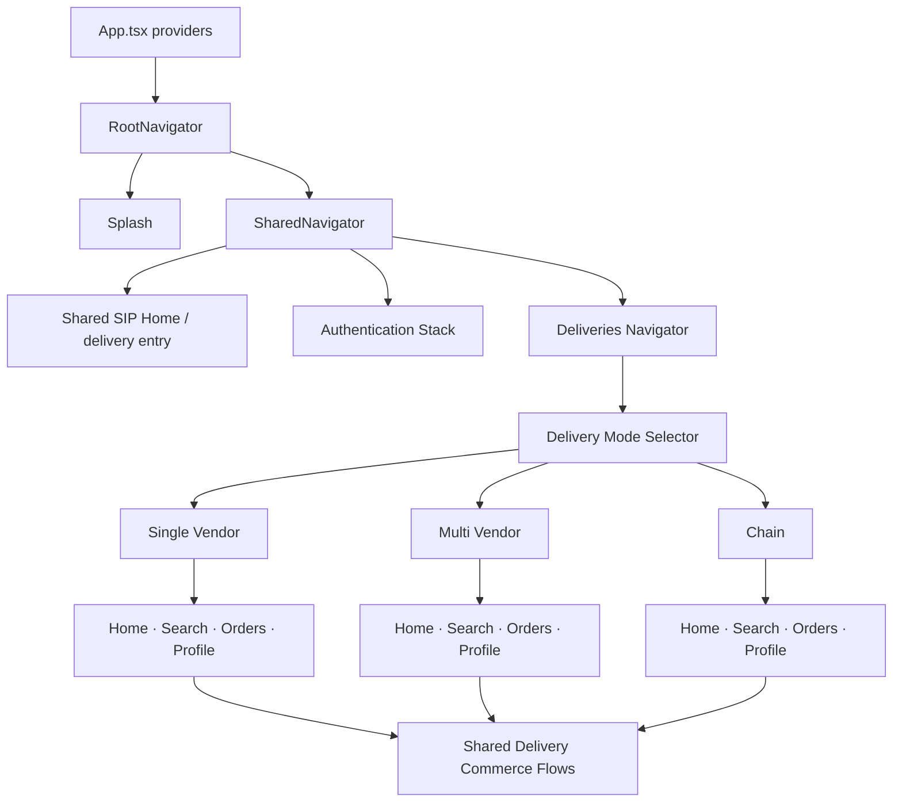
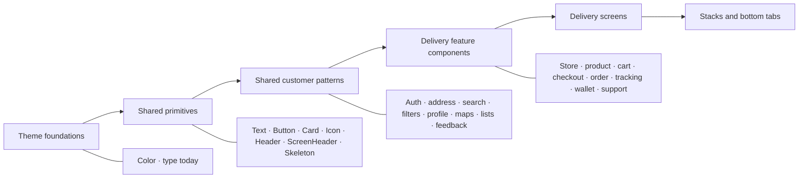
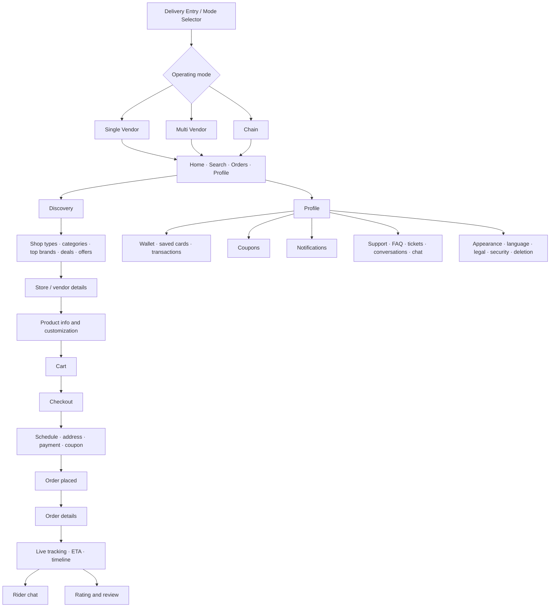

# SIP Customer — Deliveries UI Revamp Discovery

Date: 2026-09-11  
Scope: `sipp-customer`, now a deliveries-only React Native / Expo application  
Purpose: Give a design-planning model enough product, architecture, screen, component, and current-state context to produce a complete premium UI revamp brief. This is a source-level discovery document, not an implementation plan.

## 1. Executive picture

SIP Customer is now a focused delivery application. The only enabled mini-app is `deliveries`; Ride Sharing, Home Visits, Appointments, and Developer Mode are no longer part of the intended customer product.

The retained product consists of:

- A shared customer shell for launch, authentication, profile, settings, notifications, addresses, maps, feedback, and common UI primitives.
- A Deliveries domain with single-vendor, multi-vendor, and chain operating modes.
- Four primary delivery tabs in each vendor mode: Home, Search, Orders, and Profile.
- End-to-end commerce journeys for discovery, stores, products, cart, checkout, orders, tracking, ratings, chat, wallet, coupons, support, and account settings.

The app is not visually empty because it lacks UI. It feels dry because a large amount of UI is styled without a sufficiently strong shared visual grammar. Colors and basic typography are centralized, while spacing, shape, elevation, material, motion, responsive behavior, and component states are mostly decided locally. The result is a collection of individually styled delivery screens rather than one authored, premium product experience.

### Current source inventory

| Measure | Current count | Meaning |
|---|---:|---|
| Code files indexed | 762 | Current deliveries-only code graph |
| Graph nodes / edges | 3,577 / 11,382 | Still a substantial, highly connected product |
| TSX files | 487 | UI-heavy application |
| Files under screen areas | 118 | Includes screens plus screen-local helpers and styles |
| Files under component areas | 364 | Large shared and delivery-specific UI surface |
| Navigation registrations | 85 | 73 stack and 12 tab registrations |
| Unique route names | 83 | Most routes are now delivery or shared-customer journeys |

### Current UI-family inventory

Filename-based counts overlap, but accurately describe the breadth of the UI system.

| UI family | Named files | Representative examples |
|---|---:|---|
| Headers | 21 | Screen, address, cart, checkout, chat, support, store and wallet headers |
| Cards | 34 | Store, product, cart recommendation, order, wallet and offer cards |
| Buttons/actions | 18 | Shared button, tab buttons, cart controls, quick actions, floating cart |
| Inputs/search | 32 | Authentication fields, OTP, delivery search, rating input and filters |
| Bottom sheets/sheets | 14 | Address, checkout payment, filters, tips and support pickers |
| Modals/popups/dialogs | 10 | Cart conflicts, fees, deletion, image preview and verification |
| Lists/items/rows | 62 | Products, stores, orders, transactions, settings, chat and filters |
| Banners/carousels | 13 | Offers, cart status, order status, ETA and delivery media banners |
| Filters/chips/tabs | 14 | Filter chips, selected filters, quick replies and store/detail tabs |
| Empty/error/loading/skeleton states | 47 | Broad state coverage across commerce flows |
| Maps/map layers | 10 | Address selection, delivery discovery and order tracking |
| Navigation/tab components | 26 | Shared stacks, delivery stacks, bottom bars and custom tab buttons |
| Media/rating/review UI | 12 | Product images, avatars, order ratings and support media |

## 2. Current product architecture

### Design-system dependency direction

The dependency direction is sound. The design system simply stops too early: colors and basic type exist, while many high-impact visual and interaction decisions are repeated in feature code.

## 3. Complete journey and screen map

### 3.1 Shared customer shell

| Journey | Retained screens and surfaces |
|---|---|
| Launch | Splash, provider initialization, shared routing |
| Entry | SIP home header, recommended stores, services entry and location-permission popup |
| Authentication | Login, phone number, phone OTP login, phone OTP signup, email, email OTP signup, password, signup, forgot-password email, forgot-password OTP, create new password and verification-method modal |
| Address | Address search, choose on map, address detail, current location, saved-address sheet and address options |
| Profile | Profile tab, my profile, edit profile, photo editor and image viewer |
| Settings | Appearance/color mode, language, notifications, password, delete account, privacy and terms |
| Notifications | Notifications list and delivery entry points |
| Shared discovery | Generic see-all list/map, filter sheet, store map card/marker and map loading state |
| Global state/feedback | Toasts, offline notice, generic popup, skeleton, error, empty and list-state views |

Because Deliveries is now the only product, the shared SIP home should be evaluated as either:

- A valuable branded delivery landing/discovery surface, or
- An unnecessary extra navigation layer that should route directly into the appropriate delivery mode.

That is a product decision for the future plan; the current guide does not assume either outcome.

### 3.2 Deliveries navigation and commerce flow

### 3.3 Delivery screen groups

#### Discovery and home

- Delivery mode selector.
- Single-vendor home.
- Multi-vendor home and Home tab.
- Chain home.
- Address-aware home headers.
- Shop types and categories.
- Top brands and nearby stores.
- Deals, recommended restaurants and order-again sections.
- Special-offer image/video banners.
- Search tabs, recent searches, result states and filters.
- Main see-all, shop-type see-all, category see-all and deal see-all screens.
- List/map switching and map-based store discovery.

#### Store and product

- Store details.
- Single-vendor and chain delivery details.
- Vendor/store cards and rows.
- Store information, menus, subcategories and product lists.
- Product cards: standard, rail, mini, order-again and store-menu variants.
- Product information, image header, nutrition, flavour and customization/options.
- Favorite stores.

#### Cart and checkout

- Cart screen and line-item rows.
- Product quantity/action controls.
- Cart recommendations.
- Empty, loading and error states.
- Clear-cart, store-conflict and fee-information dialogs.
- Checkout summary.
- Delivery/pickup mode tabs.
- Delivery time and schedule selection.
- Address selection.
- Payment-method selection and add-card flow.
- Coupons and discount handling.
- Checkout preview and place-order states.

#### Order lifecycle

- Orders tab and order list cards.
- Order details and product summaries.
- Order-again actions.
- Modern order-tracking screen.
- Tracking map, status banner, ETA frame, progress card and timeline.
- Rider chat and quick replies.
- Rate-order screen, stars, tags, comment input and submitted state.

#### Account, wallet and settings

- Single-vendor, multi-vendor and chain profile tabs.
- My profile and edit profile.
- Wallet balance, saved cards and transactions.
- Add-card screen.
- Coupons.
- Notifications and notification settings.
- Color mode and language.
- Change password and delete account.
- Privacy policy, terms of service and terms of use.

#### Customer support

- Support home.
- FAQ list and FAQ article.
- Contact form.
- Support tickets and ticket detail.
- Support conversations.
- Support chat.
- Admin/support-agent picker sheet.
- Delete-conversation confirmation.

## 4. UI system: current implementation and flaws

| Element | Current implementation | Main flaws / risks | What the premium system needs later |
|---|---|---|---|
| Color | Central light/dark palette; delivery brand overrides; active mini-app theme scope | 58 raw hex literals remain outside `colors.ts`; semantic roles do not cover every delivery state/material; theme defaults to light rather than system | Expanded semantic roles for surfaces, containers, emphasis, selection, focus, maps, commerce status and overlays; first-class light/dark/high-contrast behavior |
| Typography | System font, shared weights and four variants | Only title/subtitle/body/caption; 474 local `fontSize` declarations; hierarchy varies; fixed line heights can become fragile at large text sizes | Delivery-oriented type roles with expressive hero moments, robust body/label/numeric roles, scaling and truncation policy |
| Spacing | Local numeric values in StyleSheets | No shared spacing/rhythm scale; section and edge spacing vary | Tokenized spacing, content insets, section cadence and density modes |
| Shape | Generic `Card` plus local radii | 361 radius declarations; arbitrary 8/10/12/14/16/20/24/999 decisions; excessive rounded containment weakens hierarchy | Small/medium/large/full shape roles; product, merchant, status and control shapes with clear meaning |
| Elevation | Local iOS shadows and Android elevation | 307 shadow-property occurrences and 41 elevation declarations; inconsistent, noisy and potentially expensive | Small elevation/material scale; tonal elevation on Android; restrained shadows/material on iOS |
| Cards | 34 named card files plus generic `Card` | Many bespoke anatomies; some placeholder vendor/delivery cards are nearly identical; card-within-card risk | Role-based merchant, product, order, wallet, offer and live-status card foundations |
| Headers | `Header`, `ScreenHeader` and 21 named header files | Independent title/back/address/cart/search/action patterns; centered/fixed layouts may struggle with long translations | Top-level, detail, contextual, address, search, commerce and tracking header variants with coordinated scroll behavior |
| Buttons | Shared primary/secondary/ghost/danger button plus local Pressables | Static opacity feedback; no shared size hierarchy, success state, haptic policy or motion token; 194 Pressables and 23 Touchables create inconsistent behavior | Clear prominence, sizes, icon contracts, loading/success transitions and platform feedback |
| Bottom navigation | Four React Navigation destinations; safe-area aware; custom buttons | Three vendor-mode implementations; static rectangular surface with border; no cohesive selection material or motion; fixed phone layout | One adaptive delivery navigation foundation with vendor-mode configuration rather than separate visual implementations |
| Bottom sheets | Shared custom swipeable sheet plus 14 named sheet files | Custom height animation uses the JS thread; no global focus, announcement, keyboard, dismissal or Reduce Motion contract | One accessible sheet foundation with platform gestures, snap tokens, focus restore and motion fallbacks |
| Lists | 25 `FlatList` and 70 `ScrollView` instances | Some long/dynamic collections may be unvirtualized; separators, grouping, padding and loading tails vary | Standardized merchant/product/order/transaction/grid/rail list roles and virtualization rules |
| Inputs/search | Shared and delivery-specific fields/search/filter controls | Many variants with inconsistent heights, focus/error styling and icon placement | Unified field anatomy and state model; search and filters as first-class delivery patterns |
| Empty/loading/error | 47 named state files; reusable Skeleton | Coverage is a strength, but appearance and emotional tone vary; skeleton has no reduced-motion fallback | Branded state language, content-shaped skeletons, recovery actions and static/crossfade alternatives |
| Feedback | Toast, popups, banners, tracking states and rating completion | Feedback hierarchy is fragmented; many bespoke surfaces | One ladder: inline, banner, toast/snackbar, sheet and blocking dialog with severity/duration rules |
| Maps | Shared map plus delivery discovery, address and tracking overlays | Absolute overlays and large elevation/z-index values can feel stacked rather than spatially connected | Edge-to-edge map system with coordinated floating controls, cards, sheets and camera movement |
| Images/media | Remote images, offer media and video banners | No single loading/caching/failure/aspect-ratio contract is evident | Shared image/media component with aspect roles, caching, progressive loading and content-aware crops |
| Icons | Expo vector icons from multiple families | Stroke weight, fill state, baseline and semantics can drift | Semantic icon registry with iOS and Android mappings and optical sizing rules |
| Accessibility | Some roles, labels, states and 44pt controls exist | 217 Pressable/Touchable usages versus 123 explicit labels indicates inconsistent coverage; no Reduce Motion implementation was found | Shared accessible primitives; 44pt iOS/48dp Android targets; announcements, focus restore, text scaling and reduced motion |
| Localization | English/French namespace structure | Some copy and formatting remain locally encoded; long translations can stress fixed layouts | Zero hardcoded user copy, locale-aware dates/currency and expansion-safe layouts |
| Adaptivity | Safe-area hooks and some dimension checks | Bottom bars and card compositions remain phone-first; no shared width-class system | Compact/medium/expanded layout tokens, rail/sidebar or two-pane patterns and constrained content widths |

## 5. Motion and “life” audit

### Existing motion

The remaining deliveries-focused tree contains approximately 73 `Animated.*` calls. Motion is concentrated in:

- Toast entrance and exit.
- Skeleton pulsing.
- Cart quantity/action feedback.
- Product information header/container behavior.
- Order-tracking transitions and sweep effects.
- Swipeable support conversations.
- Shared bottom-sheet presentation and snapping.

There is no detected product-wide motion token system, `LayoutAnimation`, Reanimated/Moti dependency, haptic policy, or Reduce Motion handling.

### Why the app still feels lifeless

Motion exists as isolated effects rather than a delivery-wide interaction language. Most merchant cards, product cards, home sections, headers, bottom tabs, lists, filters and state changes use static rendering or opacity-only press feedback. Navigation, selection, expansion, cart changes, checkout progress, order creation and status transitions do not appear to share timing, easing, spring or distance rules.

### Motion principles for the future revamp

- Snappy means low latency and short travel, not zero motion.
- A tap must react immediately; motion must never delay navigation or network work.
- Use motion to explain state, hierarchy, origin, continuity and completion.
- Prefer transform and opacity in scroll/gesture-critical paths.
- Define a small token set: instant, quick, standard and deliberate, plus one or two spring personalities.
- Merchant and product cards may compress or lift subtly on press; they should never float continuously.
- Cart quantity changes should preserve spatial continuity and confirm the updated count immediately.
- Headers should respond to scrolling and context rather than animate decoratively.
- Tab selection should use a fast indicator/icon transition while preserving platform-native navigation behavior.
- Lists should stagger only on meaningful first reveal, capped to a small number of items.
- Checkout and order-placement success should have a short, confident completion beat.
- Order tracking should animate real state changes, not fabricate activity.
- Honor iOS Reduce Motion and Android Remove Animations with crossfade or instant alternatives.

## 6. Design health score — source-level audit

| Dimension | Score | Current finding |
|---|---:|---|
| Accessibility | 2/4 | Good semantics exist in parts, but coverage and reduced-motion support are inconsistent |
| Performance | 2/4 | Some virtualization and native-driver motion exist; shadow density, JS-height sheets, ScrollViews and unstandardized images are risks |
| Appearance and theming | 2/4 | Light/dark and delivery branding exist, but semantic tokens stop before spacing, shape, elevation, material and motion |
| Platform conformance | 2/4 | Safe areas and native navigators are positive; custom bars, sheets and icons are not yet first-class iOS and Android experiences |
| Adaptivity | 1/4 | Some responsive checks exist, but navigation and composition are mainly compact-phone layouts |
| **Total** | **9/20** | **Poor: the architecture can support a premium system, but the UI layer needs a broad overhaul** |

This score is based on source evidence. It should be recalibrated after simulator/device screenshots covering iPhone, Android phone, tablet/large screen, dark appearance, large text, keyboard and reduced-motion settings.

## 7. Systemic flaws ordered by impact

### P1 — The design system ends at color and basic type

Spacing, shape, elevation, material, motion, responsive behavior, images and component states are not governed by a complete shared system. Restyling leaf screens before correcting this would create another round of inconsistency.

### P1 — Persistent navigation/header/sheet surfaces are fragmented

Bottom bars, tab buttons, headers and sheets are repeated across vendor modes and feature groups. These are the surfaces users touch most often and the strongest opportunity to communicate speed, quality and brand.

### P1 — Motion has no delivery-wide performance or accessibility contract

Some sophisticated effects exist in tracking and shared components, while most commerce interactions remain static. Custom sheet height animation runs on the JS thread, and no reduced-motion policy was found.

### P1 — The layout system is phone-first

Bottom tabs and stacked cards dominate even where tablets, landscape and large windows should use constrained widths, split views, rails or richer grid behavior.

### P2 — Card, shadow and radius proliferation flattens hierarchy

When nearly every surface becomes a rounded elevated card, product priority is communicated weakly. The app gains decoration but not meaningful depth.

### P2 — Equivalent components have inconsistent interaction states

Cards, buttons, filters, rows and icon controls do not share a complete pressed, focused, selected, disabled, loading, success and error contract.

### P2 — Accessibility, localization and image behavior depend on feature authors

Good examples exist, but compliance is not guaranteed by shared primitives. A visual revamp could introduce regressions unless these contracts are centralized first.

## 8. Platform direction

### iOS and iPadOS

Use Apple Liquid Glass only as a functional navigation/control layer. Suitable candidates include the bottom tab bar, compact toolbars, map controls and a small number of floating actions. Do not apply glass to merchant, product, order, wallet or checkout content cards. Content should scroll beneath the navigation layer while maintaining legibility, dark-mode behavior and Reduce Motion support.

References:

- https://developer.apple.com/design/human-interface-guidelines/materials
- https://developer.apple.com/documentation/technologyoverviews/liquid-glass
- https://developer.apple.com/videos/play/wwdc2025/219/

### Android

Use Material 3 Expressive principles: semantic color roles, meaningful shape hierarchy, tonal surfaces, spatial motion and navigation that adapts from a bottom bar on compact widths to rail/sidebar patterns on larger widths. Do not imitate Apple glass on Android.

References:

- https://developer.android.com/develop/ui/compose/designsystems/material3
- https://developer.android.com/r/studio-ui/designer/material/navigation-rail

### Shared SIP delivery identity

Both platforms should share content hierarchy, component anatomy, brand colors, icon semantics, type roles and motion intent. Materials, system navigation behavior, touch feedback, sheets and certain icons should resolve appropriately per platform.

## 9. Revamp boundaries

- Keep the deliveries-only product scope.
- Keep single-vendor, multi-vendor and chain operating modes unless product requirements change.
- Keep business behavior, navigation destinations, localization, API/state flows and checkout/order behavior.
- Consolidate high-leverage visual primitives before restyling hundreds of leaf components.
- Build one shared delivery anatomy, configured by vendor mode, rather than three independent design languages.
- Do not build one giant universal component with dozens of boolean props; use composable role-based variants.
- Discovery should feel appetizing, immediate and useful.
- Store and product surfaces should feel rich, scannable and trustworthy.
- Cart and checkout should feel fast, calm and unambiguous.
- Tracking should feel live, spatial and accountable.
- Wallet, support, legal and destructive actions should remain conventional and reassuring.
- Premium must never mean slower startup, delayed taps, constant animation, excessive blur, unreadable transparency or shadow-heavy card soup.

## 10. Residual references after mini-app deletion

Although the intended product is now deliveries-only, static inspection found stale references to removed mini-apps outside their deleted folders:

- Generated registry files still import and register removed mini-app modules.
- Shared home code still contains a Ride Sharing selection handler and commented service entries.
- Shared theme types and overrides still list removed mini-app IDs.
- Shared configuration state still contains Ride Sharing fields.
- Shared service-icon assets still include removed services.
- `AppSwitcherTopBar` still references removed Ride Sharing assets.
- A delivery tracking view-model references the `rideSharing` localization namespace.

These references are not part of the UI revamp target, but they should be cleaned or regenerated before implementation work so the source tree and runtime registry agree with the deliveries-only scope.

## 11. Prompt-ready context for ChatGPT

Copy the block below into the design-planning prompt, then add brand references, target audience and any business constraints.

> We are redesigning SIP Customer, a deliveries-only React Native/Expo application. Ride Sharing, Home Visits, Appointments and Developer Mode have been removed from the intended product. The retained application has a shared customer shell plus a Deliveries domain with single-vendor, multi-vendor and chain modes. Each delivery mode uses four primary tabs: Home, Search, Orders and Profile.
>
> The product includes launch, authentication, address search/map/detail, delivery discovery, shop types, categories, top brands, offers, deals, nearby stores, order again, search, filters, store details, product details/customization, favorites, cart, checkout, scheduling, address selection, payment, coupons, orders, live tracking, rider chat, ratings, profile, wallet, saved cards, transactions, notifications, support, FAQ, tickets, conversations, settings, language, appearance, password, delete account, privacy and terms.
>
> Current scale: 762 code files, 487 TSX files, 364 component-area files, 118 screen-area files, 85 navigation registrations and 83 unique route names. Major UI families include 34 card files, 21 header files, 14 sheet files, 10 modal/popup files, 62 list/item/row files, 47 state files and 26 navigation/tab files.
>
> Current strengths: modular delivery architecture; single/multi/chain vendor support; centralized light/dark colors; dynamic delivery brand-color overrides; shared Text/Button/Card/Header/ScreenHeader/Skeleton primitives; safe-area handling; English/French localization; React Navigation stacks/tabs; broad skeleton/empty/error coverage; reusable address, search, filter, profile, map and feedback patterns.
>
> Current visual problems: the design system is incomplete below colors and basic typography. There are no unified spacing, shape, elevation, material, motion, responsive, image or complete component-state tokens. The current tree has 307 shadow-property occurrences, 361 radius declarations, 474 local font-size declarations and 58 raw hex values outside the color theme. Bottom bars, headers, cards, sheets, inputs and feedback patterns are visually fragmented. The result feels functional but generic, static and phone-first.
>
> Motion currently exists mainly in toast, skeleton, cart controls, product information, order tracking, swipeable support conversations and shared sheets. There is no product-wide motion token system, Reanimated/Moti, haptic policy, LayoutAnimation or Reduce Motion handling. The custom sheet foundation animates height on the JS thread. The desired feeling is extremely quick, responsive, tactile and alive—not slow, decorative or distracting.
>
> Platform direction: on iOS 26, use Liquid Glass only for the functional navigation/control layer, such as the tab bar, map controls and compact toolbars. Do not glassify delivery content cards. On Android, use Material 3 Expressive principles, tonal surfaces and adaptive bottom-navigation/rail behavior rather than copying Apple glass. Share SIP’s component anatomy and motion intent across platforms while preserving native behavior.
>
> Emotional direction: discovery should feel appetizing, immediate and useful; store/product browsing should feel rich and trustworthy; cart/checkout should feel calm and decisive; order tracking should feel live and accountable; wallet/support/settings should feel reassuring and conventional.
>
> Produce a phased, whole-app design-system and implementation plan that starts with foundations and high-leverage primitives, then navigation/sheets/headers, shared customer journeys, delivery discovery, store/product, cart/checkout, order lifecycle, account/support, and finally accessibility/performance hardening. Define tokens, component roles and states, iOS/Android variants, motion durations/easings/springs, reduced-motion behavior, haptics, responsive width classes, dark mode, localization expansion, image behavior and acceptance criteria. Avoid generic glassmorphism, blur everywhere, gradients everywhere, uniform rounded cards, slow staggered animation, decorative motion and platform-inappropriate controls.

## 12. Required outputs from the next planning prompt

1. A replacement design-world statement and 5–7 governing principles.
2. A semantic token architecture for color, type, spacing, shape, elevation/material, motion, opacity and responsive width classes.
3. A component matrix covering all shared and delivery UI families and every interaction/loading/error/disabled/selected state.
4. Separate iOS and Android navigation/material specifications.
5. A screen migration matrix grouped by shared shell, discovery, store/product, cart/checkout, order lifecycle and account/support.
6. A motion choreography map for tap, navigation, scroll, sheet, list, cart update, checkout success, error, loading and live tracking.
7. Accessibility, localization, dark-mode, reduced-motion and large-screen acceptance criteria.
8. A phased implementation order that minimizes rework and keeps the app usable throughout the revamp.
9. A screenshot QA matrix for representative screens and device classes.
10. A “do not do” list that protects speed, clarity and native platform behavior.

## 13. Audit limitations

- This discovery is based on static source inspection and a refreshed code relationship graph.
- No build, test suite, type check, linter, bundle, simulator, emulator or live-device session was run.
- Visual scores are directional until representative screenshots are captured in light/dark mode, large text, reduced motion, keyboard-visible states, compact phone, large phone and tablet/large-window layouts.
- Filename-family counts overlap and describe design-system breadth, not distinct runtime component count.
